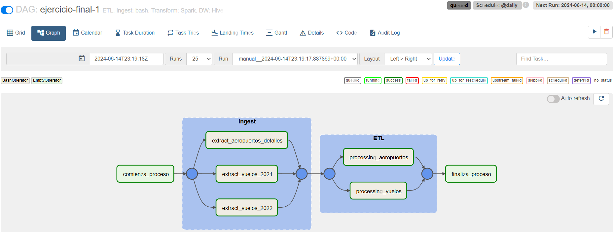
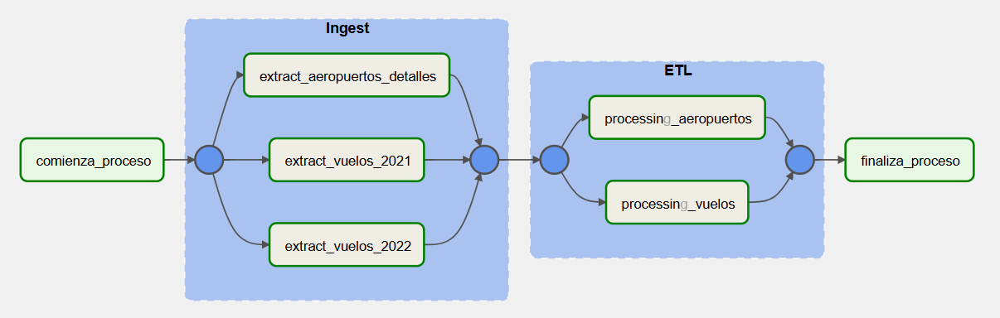
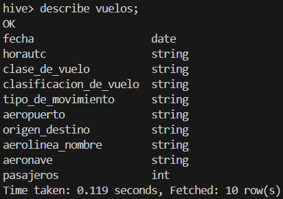
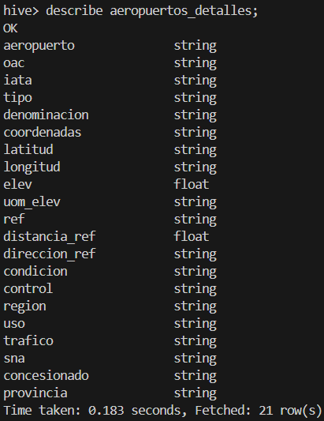
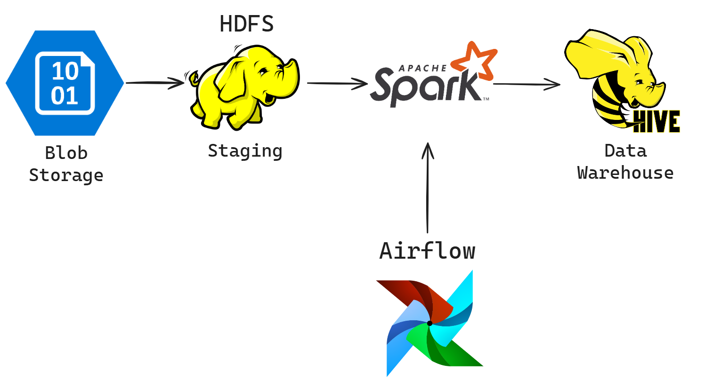
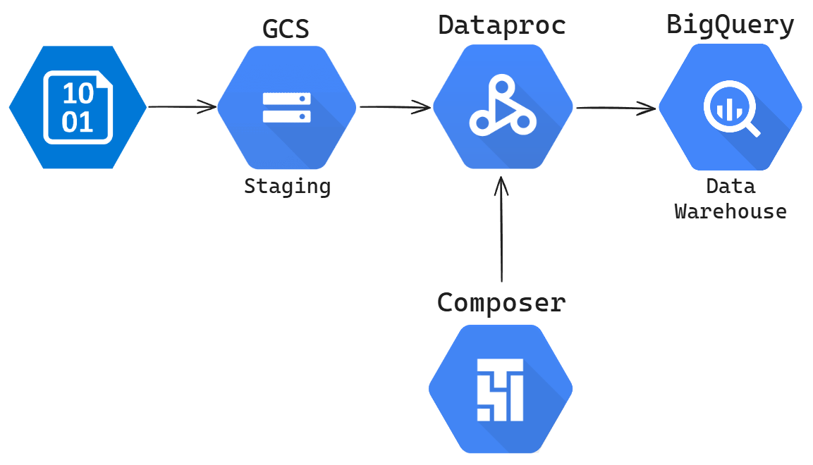
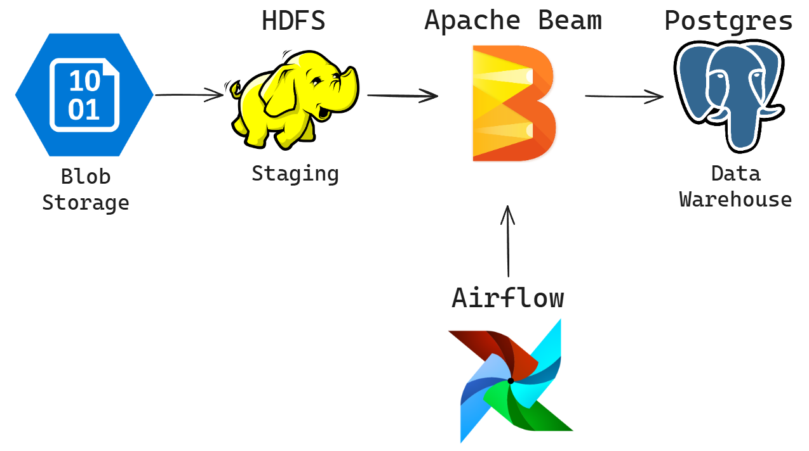
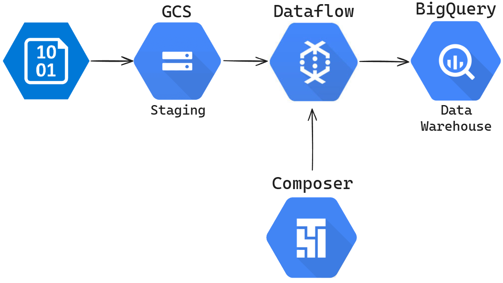

# Ejercicio 1: Aviación Civil 

### **1.** Hacer ingest de los siguientes archivos relacionados con el transporte aéreo de Argentina.

**Resolución:** Los archivos de la ingesta son: 

[ingest-vuelos-2021.sh](../../src/ejercicio-1/ingest/ingest-vuelos-2021.sh)

[ingest-vuelos-2022.sh](../../src/ejercicio-1/ingest/ingest-vuelos-2022.sh)

[ingest-aeropuertos-detalles.sh](../../src/ejercicio-1/ingest/ingest-aeropuertos-details.sh)

### **2.** Crear 2 tablas en el datawarehouse, una para los vuelos realizados en 2021 y 2022 (2021-informe-ministerio.csv y 202206-informe-ministerio):  

|         Campos         |   Tipo  |
|:----------------------:|:-------:|
| fecha                  | date    |
| horaUTC                | string  |
| clase_de_vuelo         | string  |
| clasificacion_de_vuelo | string  |
| tipo_de_movimiento     | string  |
| aeropuerto             | string  |
| origen_destino         | string  |
| aerolinea_nombre       | string  |
| aeronave               | string  |
| pasajeros              | integer |

Y otra tabla para el detalle de los aeropuertos (aeropuertos_detalle.csv):

|     Campos    |  Tipo  |
|---------------|--------|
| aeropuerto    | string |
| oac           | string |
| iata          | string |
| tipo          | string |
| denominacion  | string |
| coordenadas   | string |
| latitud       | string |
| longitud      | string |
| elev          | float  |
| uom_elev      | string |
| ref           | string |
| distancia_ref | float  |
| direccion_ref | string |
| condicion     | string |
| control       | string |
| region        | string |
| uso           | string |
| trafico       | string |
| sna           | string |
| concesionado  | string |
| provincia     | string |
 
**Resolución:** En el archivo [tables.txt](../../src/ejercicio-1/tables.txt) se puede ver el código para crear la base de datos y las tablas solicitadas en Hive. 

### **3.** Realizar un proceso automático orquestado por Airflow que ingeste los archivos previamente mencionados entre las fechas 01/01/2021 y 30/06/2022 en las dos tablas creadas.

Los archivos 202206-informe-ministerio.csv y 202206-informe-ministerio.csv → en la tabla aeropuerto_tabla

El archivo aeropuertos_detalle.csv → en la tabla aeropuerto_detalles_tabla

**Resolución:** El DAG de Airflow se puede ver en el archivo [DAG-ejercicio_final_1.py](../../src/ejercicio-1/dag/ejercicio_final_1.py).

### **4.** Realizar las siguientes transformaciones en los pipelines de datos:
- Eliminar la columna inhab ya que no se utilizará para el análisis.
- Eliminar la columna fir ya que no se utilizará para el análisis.
- Eliminar la columna “calidad del dato” ya que no se utilizará para el análisis.
- Filtrar los vuelos internacionales ya que solamente se analizarán los vuelos domésticos.
- En el campo pasajeros, si se encuentran valores nulos, convertirlos en 0 (cero).
- En el campo distancia_ref, si se encuentran valores nulos, convertirlos en 0 (cero).

**Resolución:** Las transformaciones solicitadas se realizaron en Spark y están en los archivos: 

[etl_vuelos.py](../../src/ejercicio-1/etl/etl_vuelos.py)

[etl_detalles.py](../../src/ejercicio-1/etl/etl_detalles.py)

### **5.** Mostrar mediante una impresión de pantalla que los tipos de campos de las tablas sean los solicitados en el datawarehouse (ej: fecha date, aeronave string, pasajeros integer, etc.).

**Resolución:** 

## Arquitectura

La implementación del proyecto puede verse de manera gráfica a continuación: 

### Por medio de consultas SQL al data warehouse, mostrar consulta y resultado de la query:

**6.** Determinar la cantidad de vuelos entre las fechas 01/12/2021 y 31/01/2022. 

**7.** Cantidad de pasajeros que viajaron en Aerolíneas Argentinas entre el 01/01/2021 y el 30/06/2022. 

**8.** Mostrar fecha, hora, código aeropuerto de salida, ciudad de salida, código de aeropuerto de arribo, ciudad de arribo y cantidad de pasajeros de cada vuelo, entre el 01/01/2022 y el 30/06/2022, ordenados por fecha de manera descendente. 

**9.** Cuáles son las 10 aerolíneas que más pasajeros llevaron entre el 01/01/2021 y el 30/06/2022, exceptuando aquellas aerolíneas que no tengan nombre. 

**10.** Cuáles son las 10 aeronaves más utilizadas entre el 01/01/2021 y el 30/06/2022 que despegaron desde la Ciudad Autónoma de Buenos Aires o desde Buenos Aires, exceptuando aquellas aeronaves que no cuentan con nombre. 

**Resolución 6, 7, 8, 9 y 10:** 
[Queries](queries/queries-1.md)

### **11.** Qué datos externos agregarías a este dataset que mejorarían el análisis de los datos.

El objetivo del proyecto es realizar informes acerca de los aterrizajes y despegues en todo el territorio argentino, con lo que creo que se podrían enriquecer estos informes agregando información sobre:

**Información meteorológica:** Permitiría correlacionar cómo las condiciones climáticas afectan a retrasos, cancelaciones y seguridad de los vuelos, con la finalidad de mejorar la planificación ante estos eventos climáticos. Sería útil contar con datos de temperatura, visibilidad, viento y precipitaciones en los aeropuertos de salida y arribo.

**Combustible y emisiones:** Permitiría analizar el impacto ambiental según cada vuelo o según cada grupo de vuelos. Los datos deberían ser de combustible y emisión de CO2.

**Identificador de vuelo:** La información en la tabla de vuelos no cuenta con un identificador para cada vuelo. Este identificador permitiría poder cruzar la información del vuelo con tablas con datos demográficos de los tripulantes, con datos de los pilotos y personal de servicio, y con datos de precios de boletos en caso de vuelos civiles.

**Datos de costos:** KPIs estándares en términos de vuelos como el costo por milla de asiento disponible (CASM), costo por pasajero embarcado (CPE), costo operativo directo por hora bloque (DOC) y el costo de mantenimiento por hora de vuelo, serían posibles si se tuvieran datos de los costos operativos totales, costos de mantenimiento totales y el número de asientos que una compañía aérea pone a disposición por cada milla que un avión de esta recorre.

### **12.** Elabora tus conclusiones y recomendaciones sobre este proyecto.

#### Cantidad de vuelos entre 01/12/2021 y 31/01/2022:

Hubo un número significativo de vuelos durante este período, lo que podría indicar una alta demanda de viajes durante la temporada de vacaciones de fin de año y verano.

**Recomendación:** durante próximas temporadas similares a esta, se podría ajustar la capacidad operativa (personal, aeronaves) para ofrecer un mejor servicio a la gran demanda.

#### Top 10 aerolíneas por pasajeros transportados entre 01/01/2021 y 30/06/2022:

Aerolíneas Argentinas transportó una cantidad considerable de pasajeros en este período de tiempo, confirmando su papel predominante en el mercado. Seguido están firmemente FlyBondi y JetSmart, que muestran su gran ocupación del mercado en el segmento de los vuelos a menor costo.

**Recomendación:** fortalecer alianzas estratégicas para mejorar los servicios y optimizar rutas, de modo que cada aerolínea, desde el segmento de clientes que ocupa, aumente sus operaciones.

#### Detalles de vuelos entre 01/01/2022 y 30/06/2022:

La información detallada de vuelos (fechas, horarios, aeropuertos de salida y llegada, cantidad de pasajeros) proporciona una visión de la operativa diaria.

**Recomendación:** se pueden utilizar estos datos para mejorar la programación de vuelos, minimizar tiempos de espera y optimizar el uso de aeropuertos.

#### Top 10 aeronaves más utilizadas en Buenos Aires entre 01/01/2021 y 30/06/2022:

Algunas aeronaves como EMB-ERJ190100IGW, CR-150-L, CE-152, CE-150-M, son utilizadas con mayor frecuencia, lo que indica su popularidad y posiblemente su eficiencia.

**Recomendación:** evaluar el rendimiento y costos de operación de estas aeronaves para optimizar la flota y considerar su uso en otras rutas.

#### Nuevas consultas

Como última recomendación, pueden realizarse más consultas que son interesantes para el negocio tales como:

- **Evolución mensual del número de vuelos:** para analizar tendencias y estacionalidades en el número de vuelos y planificar recursos de manera proactiva.
- **Impacto de condiciones meteorológicas en los vuelos:** cruzar los datos referidos a los vuelos con información de condiciones climáticas para desarrollar estrategias ante condiciones adversas.
- **Estadísticos referidos a la ocupación de los vuelos:** medidas como media, mediana y distribuciones pueden ser útiles para el estudio de la ocupación de los vuelos, mejorando la eficiencia de la oferta de vuelos en función de la demanda real.

### **13.** Proponer una arquitectura alternativa para este proceso, ya sea con herramientas on-premise o en la nube (si aplica).

**Resolución:** Se puede replicar la arquitectura del proyecto en la nube a través de Google Cloud Platform, integrando las herramientas Google Cloud Storage: 

*Google Cloud Storage:* Para el almacenamiento de objetos en la nube, similar a HDFS pero con mayor escalabilidad y disponibilidad.

*Dataproc:* Permite ejecutar aplicaciones de Hadoop y Spark en clústeres de máquinas virtuales. 

*Composer:* Servicio de orquestación de flujos de trabajo en la nube, permite crear, programar y monitorear flujos de trabajo de Apache Airflow. 

*BigQuery:* Datawarehouse en la nube que te permite almacenar, consultar y analizar datos de forma rápida y eficiente. Es una alternativa a Hive.

Para realizar el ETL también es posible hacer el proceso ETL con Apache Beam, y utilizar Postgres como data warehouse. 

En contraste, también es posible utilizar Beam en GCP, mediante Dataflow. 

