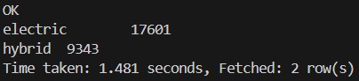
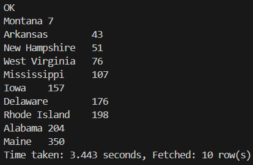
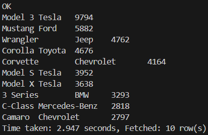
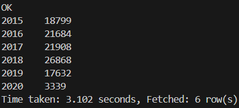
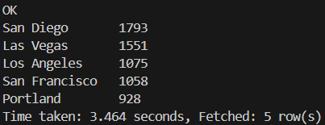
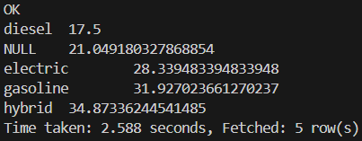

### 5. Por medio de consultas SQL al data-warehouse, mostrar:

a. Cantidad de alquileres de autos, teniendo en cuenta sólo los vehículos ecológicos (fuelType híbrido o eléctrico) y con un rating de al menos 4.

```SQL
SELECT
    fuelType,
    SUM(rentertripstaken)
FROM
    car_rental_analytics
WHERE
    (fueltype = 'electric') OR (fueltype = 'hybrid') 
AND
    rating >= 4
GROUP BY
    fuelType;
```



b. Los 5 estados con menor cantidad de alquileres (crear visualización).

```SQL
SELECT
    state_name,
    SUM(rentertripstaken) rentertripstaken
FROM
    car_rental_analytics
GROUP BY 
    state_name
ORDER BY 
    rentertripstaken ASC
LIMIT 10;
```



c. Los 10 modelos (junto con su marca) de autos más rentados (crear visualización).

```SQL
SELECT
    model,
    make,
    SUM(rentertripstaken) rentertripstaken
FROM
    car_rental_analytics
GROUP BY 
    model,
    make
ORDER BY 
    rentertripstaken DESC
LIMIT 10;
```



d. Mostrar por año, cuántos alquileres se hicieron, teniendo en cuenta automóviles fabricados desde 2010 a 2015.

```SQL
SELECT
    year,
    SUM(rentertripstaken) rentertripstaken
FROM
    car_rental_analytics
WHERE
    (year >= 2010) AND ((year >= 2015))
GROUP BY 
    year
ORDER BY 
    year;
```



e. Las 5 ciudades con más alquileres de vehículos ecológicos (fuelType híbrido o eléctrico).

```SQL
SELECT
    city,
    SUM(rentertripstaken) rentertripstaken
FROM
    car_rental_analytics
WHERE
    (fueltype = 'electric') OR (fueltype = 'hybrid') 
GROUP BY 
    city
ORDER BY 
    rentertripstaken DESC
LIMIT 5;
```



f. El promedio de reviews, segmentando por tipo de combustible.

```SQL
SELECT
    fueltype,
    AVG(reviewcount) avg_review_count
FROM
    car_rental_analytics
GROUP BY 
    fueltype
ORDER BY
    avg_review_count;
```


