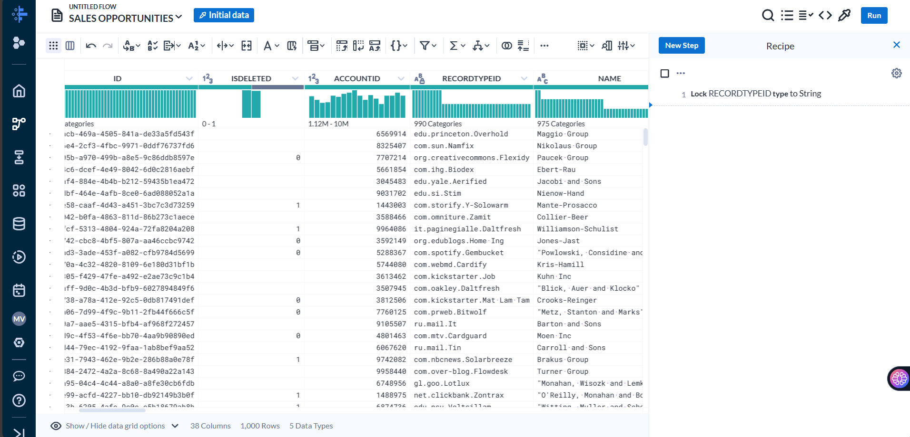
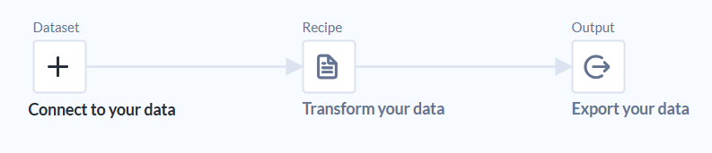
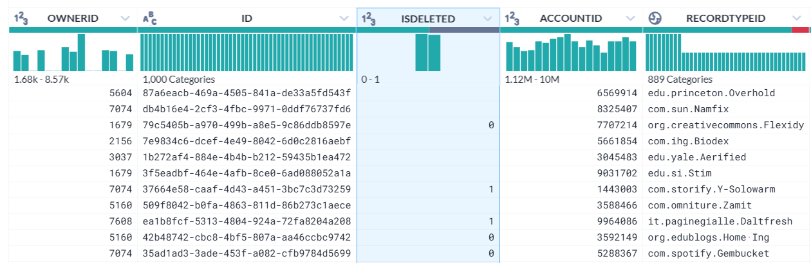
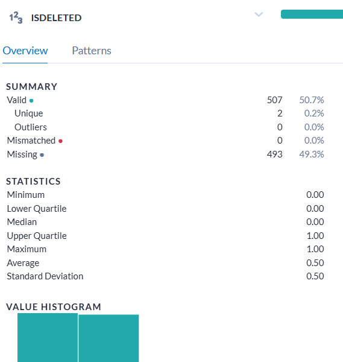

# Ejercicio 3: Google Skills Boost - Dataprep

### **1.** ¿Para qué se utiliza Dataprep?

Dataprep es una herramienta que se puede utilizar en GCP y se utiliza para explorar, limpiar y transformar conjuntos de datos para su análisis, estos datos pueden ser estructurados y no estructurados.

Dataprep facilita la transformación de datos sin tener que escribir código, utilizando una interfaz visual y automatizaciones.

### **2.** ¿Qué cosas se pueden realizar con Dataprep?

Es posible conectarse a diversas fuentes de datos como: Cloud Storage, BigQuery, bases de datos SQL, archivos locales, entre otras.

Explorar datos: Obtener información sobre los datos, como tipos de datos, valores únicos, distribuciones, relaciones, máximos, mínimos, etc.

Limpiar datos: Eliminar valores duplicados, corregir errores ortográficos, formatear datos inconsistentes y más.

Transformar datos: Filtrar, agregar, eliminar, ordenar, unir y agregar campos a los datos.

Enriquecer datos: Combinar tus datos con otras fuentes, o crear otras columnas mediante cálculos para obtener información adicional.

Automatizar tareas: Crear flujos de trabajo para ejecutar transformaciones de datos de forma repetitiva.

Exportar los datos: Exportar datos a BigQuery, Cloud SQL y otras herramientas de análisis.

### **3.** ¿Por qué otra/s herramientas lo podrías reemplazar? ¿Por qué?

**Dataflow:** Es ideal para procesamientos de datos a gran escala y en tiempo real, con alta escalabilidad y rendimiento. Además posee templates para acceder rápidamente a pipelines ya diseñados, que pueden ser personalizados y automatizarse para su ejecución recurrente. La diferencia con Dataprep, es que Dataflow no ofrece la misma interfaz intuitiva y las capacidades de preparación de datos interactivos.

**Data Fusion:** Permite la creación de flujos de trabajo de datos visualmente, utilizando una interfaz gráfica. Es utilizado para la integración de datos, orquestación de flujos de trabajo de datos y automatización de tareas de preparación de datos. La diferencia con Dataprep es que Data Fusion se enfoca en la orquestación de flujos de trabajo, mientras que Dataprep ofrece una gama más amplia de herramientas para la limpieza y transformación de datos.

### **4.** ¿Cuáles son los casos de uso comunes de Dataprep de GCP?

**Preparación de datos para análisis:** Limpiar, transformar y enriquecer datos para su uso en herramientas de análisis como BigQuery y Tableau, y para herramientas de ML e IA.

**Integración de datos:** Combinar datos de diferentes fuentes para obtener una vista completa de tu negocio.

**Crear flujos de trabajo reutilizables:** Dataprep permite crear flujos de trabajo de preparación de datos reutilizables que pueden aplicarse a nuevos conjuntos de datos con similar estructura. 

**Cumplimiento normativo:** Dataprep permite establecer reglas de negocio personalizadas para validar los datos y garantizar que cumplan con los requisitos específicos de la organización.

### **5.** ¿Cómo se cargan los datos en Dataprep de GCP?

Se cargan creando un nuevo flujo de datos, o desde la sección "Import Data" en la pantalla de inicio de la plataforma. 

Es posible cargar datos de Cloud Storage, BigQuery, Google Sheets (CSV, JSON, Parquet, etc.), bases de datos (Cloud SQL, MySQL, PostgreSQL y SQL Server), aplicaciones (Salesforce y Marketo) y archivos locales.

### **6.** ¿Qué tipos de datos se pueden preparar en Dataprep de GCP?

Datos estructurados (csv, parquet, avro, etc.), datos semi estructurados (JSON, XSML, etc.) y datos no estructurados (audio, imágenes), aunque en este último tipo, tiene funciones limitadas. 

### **7.** ¿Qué pasos se pueden seguir para limpiar y transformar datos en Dataprep de GCP?

1. Conectar a tus datos: Seleccionar la fuente de datos y cargar los datos en Dataprep.
2. Explorar los datos: Analizar la información sobre los datos, como tipos de datos, valores únicos, distribuciones y relaciones.

3. Limpiar los datos: Eliminar valores duplicados, corregir errores ortográficos, formatear fechas y horas, estandarizar valores de texto.
4. Transformar los datos: Filtrar, agregar, eliminar, ordenar, unir y agregar campos a tus datos.
5. Guardar conjuntos de datos: Guarde los datos transformados en Cloud Storage o BigQuery para su acceso posterior.

### **8.** ¿Cómo se pueden automatizar tareas de preparación de datos en Dataprep de GCP?

La preparación de datos se puede automatizar mediante el uso de las "Recetas" (Recipes).

Las recetas son conjuntos de pasos de transformación que se pueden guardar y aplicar a nuevos conjuntos de datos.

Para crear una receta, primero hay que crear un flujo de datos con las transformaciones que se quieren automatizar y después guardar el flujo de datos como una receta.

Una vez que se tiene la receta, se puede aplicarla a nuevos conjuntos de datos con la función "Ejecutar receta".

### **9.** ¿Qué tipos de visualizaciones se pueden crear en Dataprep de GCP?

Dataprep te permite utilizar los siguientes tipos de visualizaciones:

**Gráficos de dispersión:** para mostrar la relación entre dos variables.

**Gráficos de barras:** para comparar valores de diferentes categorías.

**Histogramas:** para mostrar la distribución de los valores de una variable.

**Tablas de resumen:** para mostrar estadísticas descriptivas de los datos.

### **10.** ¿Cómo se puede garantizar la calidad de los datos en Dataprep de GCP?

Para garantizar la calidad de los datos en Dataprep, se puede poner atención en las siguientes secciones:

Perfilado automático de datos: Cuando se carga un conjunto de datos en Dataprep, se genera un perfil de datos que proporciona estadísticas sobre los datos, como el recuento de valores nulos, duplicados y distribuciones de valores. Prestar especial atención a este apartado puede brindar una buena noción de la calidad de los datos. 

Recomendaciones de transformaciones: Dataprep ofrece sugerencias para corregir el tipo de dato de la columna, formatos de fechas, eliminar duplicados, entre otras.

Reglas de validación: Se pueden crear reglas de validación para verificar formatos de fecha específicos, valores dentro de un rango permitido, patrones de texto, etc.

Trazabilidad: Dataprep permite rastrear todas las transformaciones, trabajos ejecutados y que usuario lo realizó. 