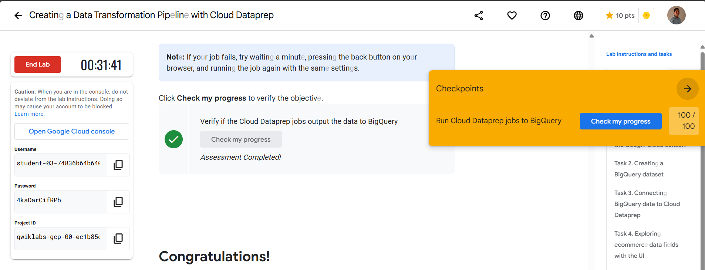

# Ejercicio 1: Aviación Civil

La Administración Nacional de Aviación Civil necesita una serie de informes para elevar al Ministerio de Transporte acerca de los aterrizajes y despegues en todo el territorio argentino, como por ejemplo: cuáles aviones son los que más volaron, cuántos pasajeros volaron, ciudades de partidas y aterrizajes entre fechas determinadas, etc. Usted, como data engineer, deberá realizar un pipeline con esta información, automatizarlo y realizar los análisis de datos solicitados que permitan responder las preguntas de negocio y hacer sus recomendaciones con respecto al estado actual.

**Consignas y resolución:** [Aviación Civil](docs/ejercicio-1/aviacion.md)

# Ejercicio 2: Alquiler de automóviles

Una de las empresas líderes en alquileres de automóviles solicita una serie de dashboards y reportes para poder basar sus decisiones en datos. Entre los indicadores mencionados se encuentran total de alquileres, segmentación por tipo de combustible, lugar, marca y modelo de automóvil, valoración de cada alquiler, etc.

Como Data Engineer debe crear y automatizar el pipeline para tener como resultado los datos listos para ser visualizados y responder las preguntas de negocio.

**Consignas y resolución:** [Alquiler de automóviles](docs/ejercicio-2/car_rental_data.md)

# Ejercicio 3: Google Skills Boost

Realizar el siguiente LAB, al finalizar pegar un print screen donde se ve su perfil y el progreso
final verificado: 

https://www.cloudskillsboost.google/focuses/4415?catalog_rank=%7B%22rank%22%3A1%2C%22num_filters%22%3A0%2C%22has_search%22%3Atrue%7D&parent=catalog&search_id=32278924

**Resolución:** 

### Contestar las siguientes preguntas: 

1. ¿Para qué se utiliza Dataprep?
2. ¿Qué cosas se pueden realizar con Dataprep?
3. ¿Por qué otra/s herramientas lo podrías reemplazar? ¿Por qué?
4. ¿Cuáles son los casos de uso comunes de Dataprep de GCP?
5. ¿Cómo se cargan los datos en Dataprep de GCP?
6. ¿Qué tipos de datos se pueden preparar en Dataprep de GCP?
7. ¿Qué pasos se pueden seguir para limpiar y transformar datos en Dataprep de GCP?
8. ¿Cómo se pueden automatizar tareas de preparación de datos en Dataprep de GCP?
9. ¿Qué tipos de visualizaciones se pueden crear en Dataprep de GCP?
10. ¿Cómo se puede garantizar la calidad de los datos en Dataprep de GCP?

**Resolución:** [Respuestas Google Skills Boost](src/ejercicio-3/respuestas.md)

# Ejercicio 4: Arquitectura 

El gerente de Analítica te pide realizar una arquitectura hecha en GCP que contemple el uso de Dataprep, ya que le parece muy fácil de usar y tiene una interfaz visual que ayuda a sus desarrolladores, ya que no necesitan conocer ningún lenguaje de desarrollo.

Esta arquitectura debería contemplar las siguientes etapas:

**1. Ingesta**: datos parquet almacenados en un bucket de S3 y datos de una aplicación que guarda sus datos en Cloud SQL.

**2. Procesamiento**: filtrar, limpiar y procesar datos provenientes de estas fuentes.

**3. Almacenamiento**: almacenar los datos procesados en BigQuery.

**4. BI**: herramientas para visualizar la información almacenada en el Data Warehouse.

**5. ML**: herramienta para construir un modelo de regresión lineal con la información almacenada en el Data Warehouse.

**Resolución:** [Arquitectura](src/ejercicio-4/arquitectura.md)
