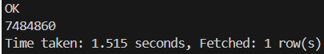
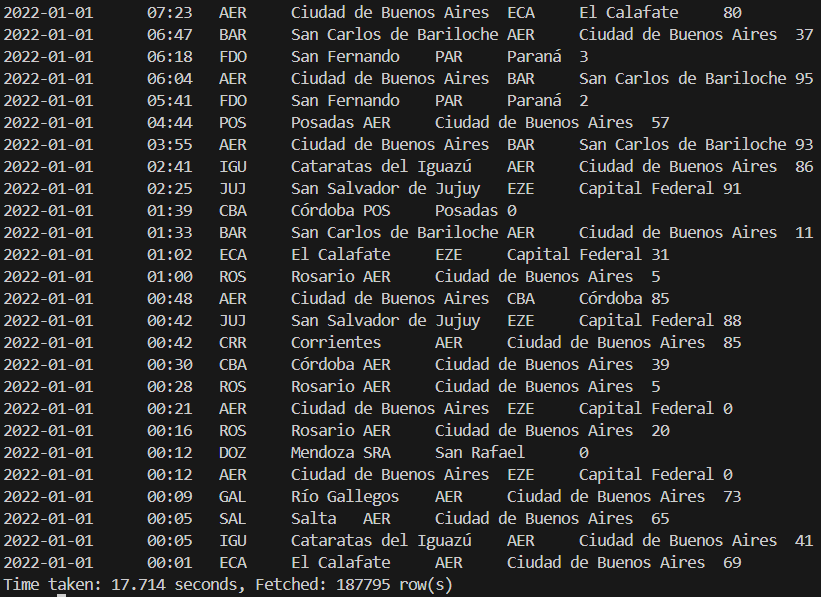
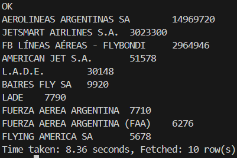
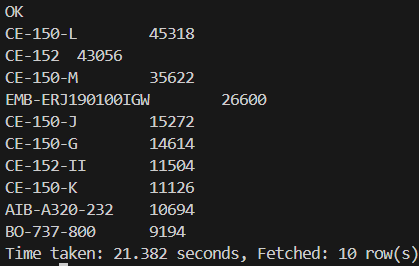

**6.** Determinar la cantidad de vuelos entre las fechas 01/12/2021 y 31/01/2022. Mostrar consulta y resultado de la query.

**Resolución:** 

```sql
SELECT 
    COUNT(*)
FROM
    vuelos
WHERE
    fecha BETWEEN "2021-12-01" AND "2022-01-31";
```

**7.** Cantidad de pasajeros que viajaron en Aerolíneas Argentinas entre el 01/01/2021 y el 30/06/2022. Mostrar consulta y resultado de la query.

**Resolución:** 

```
SELECT 
    SUM(pasajeros)
FROM 
    vuelos
WHERE 
    aerolinea_nombre="AEROLINEAS ARGENTINAS SA"
AND
    fecha BETWEEN "2021-01-01" AND "2022-06-30";
```



**8.** Mostrar fecha, hora, código aeropuerto de salida, ciudad de salida, código de aeropuerto de arribo, ciudad de arribo y cantidad de pasajeros de cada vuelo, entre el 01/01/2022 y el 30/06/2022, ordenados por fecha de manera descendente. Mostrar consulta y resultado de la query.

**Resolución:** 

```
SELECT DISTINCT
    v.fecha,
    v.horautc,
    CASE 
        WHEN v.tipo_de_movimiento = 'Despegue' THEN v.aeropuerto 
        ELSE v.origen_destino 
    END AS codigo_aeropuerto_salida,
    ad_salida.ref AS ciudad_salida,
    CASE 
        WHEN v.tipo_de_movimiento = 'Aterrizaje' THEN v.aeropuerto 
        ELSE v.origen_destino 
    END AS codigo_aeropuerto_arribo,
    ad_arribo.ref AS ciudad_arribo,
    v.pasajeros
FROM
    vuelos v

LEFT JOIN 
    aeropuertos_detalles ad_salida 
ON 
    ad_salida.aeropuerto = CASE 
                            WHEN v.tipo_de_movimiento = 'Despegue' THEN v.aeropuerto 
                            ELSE v.origen_destino 
                            END
LEFT JOIN 
    aeropuertos_detalles ad_arribo 
ON ad_arribo.aeropuerto = CASE 
                            WHEN v.tipo_de_movimiento = 'Aterrizaje' THEN v.aeropuerto 
                            ELSE v.origen_destino 
                            END
WHERE
    fecha BETWEEN "2022-01-01" AND "2022-06-30"
ORDER BY
    v.fecha DESC;
```


**9.** Cuáles son las 10 aerolíneas que más pasajeros llevaron entre el 01/01/2021 y el 30/06/2022, exceptuando aquellas aerolíneas que no tengan nombre. Mostrar consulta y visualización.

**Resolución:** 

```
SELECT DISTINCT 
    aerolinea_nombre,
    SUM(pasajeros) OVER(PARTITION BY aerolinea_nombre) pasajeros_sum
FROM 
    vuelos
WHERE 
    aerolinea_nombre IS NOT NULL
AND
    aerolinea_nombre != '0'
AND
    fecha BETWEEN "2021-01-01" AND "2022-06-30"
ORDER BY 
    pasajeros_sum DESC
LIMIT 10;
```



**10.** Cuáles son las 10 aeronaves más utilizadas entre el 01/01/2021 y el 30/06/2022 que despegaron desde la Ciudad Autónoma de Buenos Aires o desde Buenos Aires, exceptuando aquellas aeronaves que no cuentan con nombre. Mostrar consulta y visualización.

**Resolución:** 

```
SELECT DISTINCT
    v.aeronave,
    COUNT(v.aeronave) OVER(PARTITION BY aeronave) aeronave_sum
FROM
    vuelos v
LEFT JOIN
    aeropuertos_detalles ad
ON ad.aeropuerto = v.aeropuerto
WHERE 
    tipo_de_movimiento = 'Despegue'
AND
    fecha BETWEEN "2021-01-01" AND "2022-06-30"
AND 
    ad.provincia LIKE '%BUENOS AIRES' 
AND
    v.aeronave != '0'
ORDER BY 
    aeronave_sum DESC
LIMIT 10;
```

