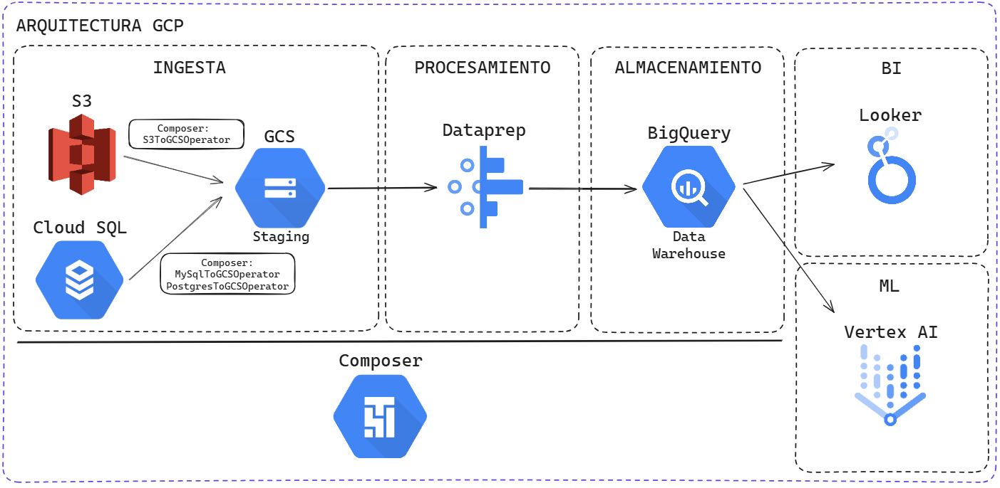

# Ejercicio 4: Arquitectura 

El gerente de Analítica te pide realizar una arquitectura hecha en GCP que contemple el uso de Dataprep, ya que le parece muy fácil de usar y tiene una interfaz visual que ayuda a sus desarrolladores, ya que no necesitan conocer ningún lenguaje de desarrollo.

Esta arquitectura debería contemplar las siguientes etapas:

**1. Ingesta**: Datos parquet almacenados en un bucket de S3 y datos de una aplicación que guarda sus datos en Cloud SQL.

**2. Procesamiento**: Filtrar, limpiar y procesar datos provenientes de estas fuentes.

**3. Almacenamiento**: almacenar los datos procesados en BigQuery.

**4. BI**: herramientas para visualizar la información almacenada en el Data Warehouse.

**5. ML**: herramienta para construir un modelo de regresión lineal con la información almacenada en el Data Warehouse.
 
# Desarrollo 

### 1. Ingesta

**Datos Parquet en S3:** Utilizar Google Cloud Composer para orquestar la transferencia de archivos Parquet desde el bucket de Amazon S3 a un bucket en Google Cloud Storage (GCS). Esto se puede lograr utilizando operadores de Airflow como S3ToGCSOperator.

**Datos de Cloud SQL:** Utilizar Cloud Composer para automatizar la exportación de datos desde Cloud SQL a GCS. Esto se puede realizar mediante operadores de Airflow como MySqlToGCSOperator o PostgresToGCSOperator.

**Google Cloud Storage (GCS):** Almacenar tanto los datos exportados desde Cloud SQL como los datos transferidos desde S3 en un bucket de GCS que actúa como una área de staging.

### 2. Procesamiento

**Google Cloud Dataprep:** Conectar Dataprep a los datos almacenados en GCS. Realizar tareas de limpieza, filtrado y procesamiento de datos utilizando la interfaz visual de Dataprep. 

Configurar flujos de trabajo (recipes) en Dataprep para automatizar estos procesos de transformación.

Utilizar Composer para orquestar la ejecución de tareas en Dataprep.

### 3. Almacenamiento

**Google BigQuery:** Crear datasets y tablas en BigQuery para organizar los datos transformados.

Configurar Dataprep para exportar los datos procesados a BigQuery.

### 4. BI 

**Looker:** Conectar Looker a BigQuery para crear dashboards interactivos y reportes.

### 5. ML

**Vertex AI:** Utilizar Vertex AI para construir, entrenar y desplegar un modelo de regresión lineal.

Aunque también se puede utilizar BigQuery ML como una alternativa rápida y simple para entrenar modelos de ML directamente en BigQuery, si los requerimientos son básicos. 

# Modelado 

